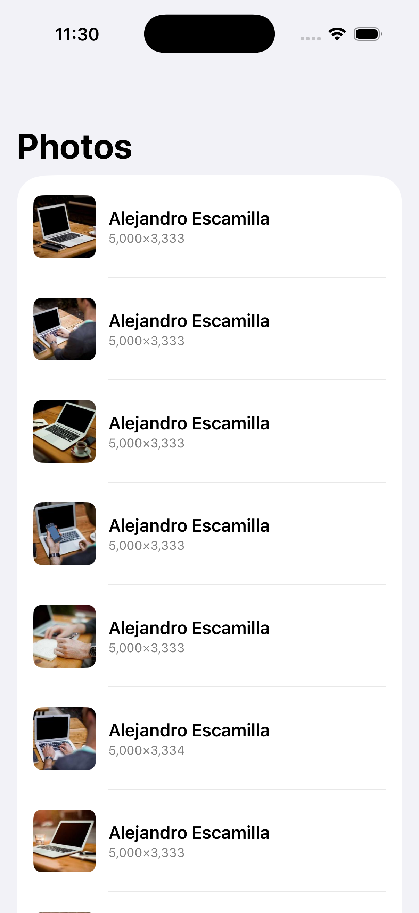

# LazyListDemo

A small SwiftUI iOS app that displays the [Picsum](https://picsum.photos) `/v2/list` photo feed in a lazy `List`. Demonstrates NSCache-backed thumbnail caching, in-flight request deduplication, and bounded prefetch — split across modular Swift packages.

<p align="center">
  
</p>

## Requirements

- Xcode 16+ (Swift 6.0 language mode)
- iOS 26.4 simulator or device
- Universal (iPhone + iPad)

## Project layout

```
App (LazyListDemo.xcodeproj target — LazyListDemoApp + ContentView)
 └─ PhotosFeature       (VMs + Views — MainActor by default)
     ├─ PhotoModels     (Photo struct — Foundation only)
     └─ PhotosNetworking (PhotoService + ImageLoader actor)
         ├─ PhotoModels
         └─ ImageCacheKit (NSCache wrapper)
```

The codebase is split into four local Swift packages under `Packages/` plus the App target. Only `PhotosFeature` opts into `defaultIsolation(MainActor.self)`; the leaf modules stay nonisolated by default.

| Package | Responsibility |
| --- | --- |
| `PhotoModels` | `Photo` value type, Foundation only — platform-agnostic |
| `ImageCacheKit` | `NSCache`-backed image cache wrapper |
| `PhotosNetworking` | `PhotoService` (REST) + `ImageLoader` actor with request dedup |
| `PhotosFeature` | View models and SwiftUI views — `@MainActor` by default |

## Build and test

All commands run from the repo root.

```bash
# Build the app (workspace builds all packages + App in dependency order)
xcodebuild -workspace LazyListDemo.xcworkspace -scheme LazyListDemo \
  -destination 'platform=iOS Simulator,name=iPhone 17' build

# Run app + integration tests
xcodebuild -workspace LazyListDemo.xcworkspace -scheme LazyListDemo \
  -destination 'platform=iOS Simulator,name=iPhone 17' test

# Test a specific module (PhotoModels, ImageCacheKit, PhotosNetworking, PhotosFeature)
xcodebuild -workspace LazyListDemo.xcworkspace -scheme PhotosFeature \
  -destination 'platform=iOS Simulator,name=iPhone 17' test

# PhotoModels is platform-agnostic — fastest feedback via host SwiftPM
swift test --package-path Packages/PhotoModels
```

Substitute a real device name from `xcrun simctl list devices available` if `iPhone 17` isn't available locally.

## Tests

- **Module tests** (`Packages/<Module>/Tests/`) use Swift Testing (`@Test`, `#expect`).
- **`LazyListDemoTests/`** — Swift Testing, hosted by the App target.
- **`LazyListDemoUITests/`** — XCTest with `XCUIApplication`.
